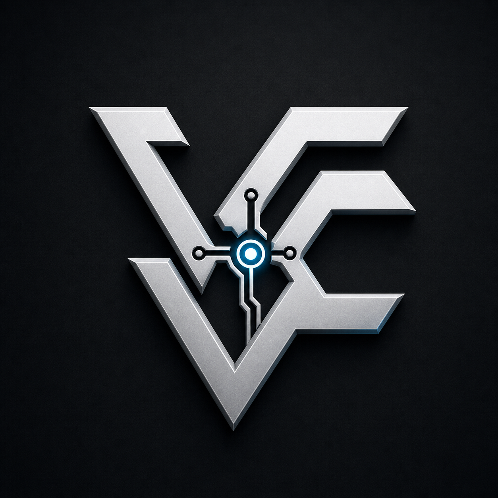

# Hi, I'm Vernaculus.

### ML systems · Automation · Product engineering

I mostly build tools, systems, and experiments that I would actually want to use myself — then make them solid enough to stand on their own.

## What I work on

My experience spans ML research, automation, backend systems, integrations, web interfaces, and cross-platform applications. I am comfortable moving between unfamiliar domains, choosing practical tools, and carrying a project from early exploration to working software.

That range matters to me more than fitting into one narrow category. A project might call for model experiments and evaluation, a reliable service around an external API, a Telegram workflow, or a complete application with its own interface. I enjoy solving each kind of problem on its own terms.

## Across the stack

I have worked across machine learning, automation, backend development, integrations, product engineering, web interfaces, mobile applications, and internal tools. The exact stack changes from project to project; the aim stays the same: build something clear, dependable, and useful.

I value reproducible experiments, explicit verification, and documentation that explains what a project actually does. I like software that survives contact with reality and still feels clean a month later.
